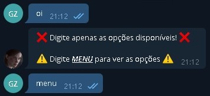

# Bot Telegram Cardápio
Telebot

## Sobre
Bot desenvolvido em `Python` utilizando a biblioteca `Telebot do Telegram`, com o objetivo de fornecer informações de contato e cardápio de cada estabelecimento na cidade de `Jerônimo Monteiro - ES`, podendo filtrar a pesquisa por categorias.

### Requisitos
```
pip3 install telebot
```
### Documentação
- [Telegram Bot API](https://core.telegram.org/bots/api)
- [Telegram Bot API Token](https://www.siteguarding.com/en/how-to-get-telegram-bot-api-token)

### Demonstração



### Créditos
__Desenvolvido por:__
```
Gabriel Aparecido Zucoloto
```
- [Linkedin](https://www.linkedin.com/in/gabriel-zucoloto-51a51b231)
- [Portfolio](https://bielzucoloto.github.io/)
